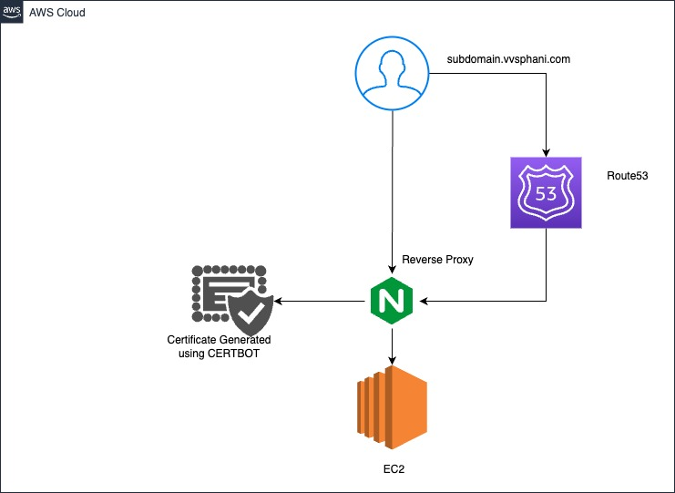

# Capturing Urban Pulses and its Social Fabrics

Urban areas are complex and dynamic environments, constantly changing and evolving over time. As cities grow and change, they present a range of challenges for city planners, architects, and human behavioral experts to understand and navigate. Recent advancements in technology have enabled the collection and analysis of vast amounts of data, providing new opportunities to gain insights into the dynamics of urban environments.

This project builds on two previous studies, one focused on the concept of ”[urban pulses](https://fmiranda.me/publications/urban-pulse/tvcg-2017-urbanpulse.pdf)” and the other on the use of points
of interest (POIs) to understand the social fabrics of urban areas [POI](http://urban-computing.com/urbcomp2022/file/UrbComp2022_paper_6824.pdf).

# [Final Report](final_report.pdf)

## Deployment Details using Amazon EC2 and Certbot

### Architectural Diagram

To provide live demonstrations of this, I have set up an Amazon EC2 instance along with SSL certificates using Certbot. Here's how I've done it:

1. **Amazon EC2 Instance Setup:**
   - I created an Amazon EC2 instance based on Amazon Linux 2023.
   - The instance is configured with the necessary resources to host and run my applications.

2. **Subdomain Configuration:**
   - I configured a subdomain (e.g., upsf.vvsphani.com) in Amazon Route 53 to point to the IP address of my EC2 instance.

3. **SSL Certificate Installation with Certbot:**
   - To ensure secure communication between visitors and the server, I used Certbot to install SSL certificates for my subdomain.
   - This enables HTTPS for my live demos, enhancing security and user trust.

4. **Web Server Configuration:**
   - I set up an Nginx web server on the EC2 instance to serve my applications.
   - The server is configured to listen on the appropriate ports (80 for HTTP and 443 for HTTPS) and forward traffic to correct port.

## Accessing Live Demos

You can access the live demo of this application by visiting the subdomain I have configured:

- Demo Subdomain: [upsf.vvsphani.com](https://upsf.vvsphani.com/?data1=data/philadelphia,yelp,none)
...

*Contact Information:*
- Email: [phani.vakicherla@gmail.com](mailto:phani.vakicherla@gmail.com)
- LinkedIn: [SeshaPhaniVV](https://www.linkedin.com/in/phani-vvs-465271137/)

---

